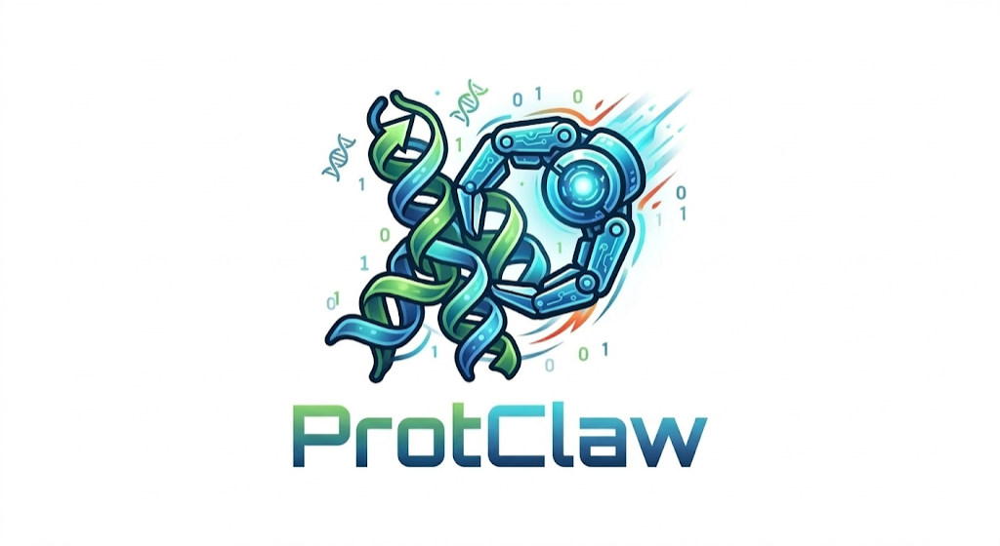

<p align="center">
  
</p>

<h1 align="center">ProtClaw</h1>

<p align="center"><strong>Protein Design Agentic System</strong> — LLM as CPU, Agents as System, Skills as Software, Toolkits as Pluggable Scientific Capability Packs.</p>

<p align="center">
Built on <a href="https://github.com/qwibitai/nanoclaw">NanoClaw</a> + <a href="https://platform.claude.com/docs/en/agent-sdk/overview">Anthropic Claude Agent SDK</a>
</p>

> Run a full de novo protein design pipeline in one command — backbone generation, sequence design, structure prediction, quality control, candidate ranking, and experiment packaging — all orchestrated by AI agents.

---

## Table of Contents

- [Architecture](#architecture)
- [De Novo Pipeline](#de-novo-pipeline)
- [Getting Started](#getting-started)
- [Usage](#usage)
- [Skills Reference](#skills-reference)
- [Adding a New Skill](#adding-a-new-skill)
- [Adding a New Toolkit](#adding-a-new-toolkit)
- [Target Configuration](#target-configuration)
- [Agent System](#agent-system)
- [Repository Structure](#repository-structure)
- [Development](#development)
- [Troubleshooting](#troubleshooting)
- [Roadmap](#roadmap)
- [License](#license)

---

## Architecture

ProtClaw is a three-layer system:

```
                        ProtClaw Architecture

    ┌─────────────────────────────────────────────────────────┐
    │                 Control Plane (TypeScript)               │
    │                                                         │
    │  Orchestrator ── DAG Executor ── Resource Scheduler      │
    │       │              │                │                  │
    │  IPC Watcher    Pipeline Builder   GPU/CPU Slots         │
    │       │              │                                   │
    │  Agent Container (Claude Agent SDK + MCP Tools)          │
    │       │                                                  │
    │  Channels: CLI · Slack · WhatsApp · Telegram             │
    └───────────────────────┬─────────────────────────────────┘
                            │ SSH / Docker
    ┌───────────────────────▼─────────────────────────────────┐
    │            Science Execution Plane (Python)              │
    │                                                         │
    │  ┌──────────┐ ┌──────────┐ ┌─────────┐ ┌─────────────┐ │
    │  │RFdiffusion│ │ProteinMPNN│ │ ESMFold │ │Structure QC │ │
    │  └──────────┘ └──────────┘ └─────────┘ └─────────────┘ │
    │  ┌──────────────┐ ┌──────────────┐ ┌──────────────────┐ │
    │  │Developability │ │Candidate Ops │ │Experiment Package│ │
    │  └──────────────┘ └──────────────┘ └──────────────────┘ │
    └───────────────────────┬─────────────────────────────────┘
                            │
    ┌───────────────────────▼─────────────────────────────────┐
    │             Knowledge Plane (Contracts)                  │
    │                                                         │
    │  JSON Schema → Zod (TypeScript) + Pydantic (Python)      │
    │  ProjectSpec · DesignPlan · CandidateCard · Evidence     │
    └─────────────────────────────────────────────────────────┘
```

**Control Plane** — TypeScript orchestrator (NanoClaw fork) that manages message routing, agent containers, DAG execution, resource scheduling (GPU/CPU slots), and IPC between agents and science tools.

**Science Execution Plane** — Python adapters that wrap computational biology tools (RFdiffusion, ProteinMPNN, ESMFold, etc.). Executed remotely via SSH on GPU servers or locally via Docker.

**Knowledge Plane** — Shared JSON Schema contracts that define domain types (ProjectSpec, DesignPlan, CandidateCard, etc.), compiled to both TypeScript (Zod) and Python (Pydantic) for type safety across the stack.

---

## De Novo Pipeline

The golden path runs 8 steps in a DAG:

```
backbone_generate (RFdiffusion, GPU)        ~35s
  └─> sequence_design (ProteinMPNN, GPU)    ~4s
        ├─> structure_predict (ESMFold, GPU) ~53s
        │     └─> structure_qc (CPU)         <1s
        └─> developability_check (CPU)       <1s
              └─> candidate_cluster (CPU)     <1s
                    └─> candidate_rank (CPU)  <1s
                          └─> experiment_package (CPU) <1s
```

*Timings measured on 4x RTX 4080 SUPER (GPUHub). Total: ~4 minutes.*

**What each step does:**

| Step | Skill | What it does |
|------|-------|-------------|
| 1 | RFdiffusion | Generates protein backbone structures via denoising diffusion |
| 2 | ProteinMPNN | Designs amino acid sequences that fold into the backbone |
| 3 | ESMFold | Predicts 3D structure from designed sequences (validates designability) |
| 4 | Structure QC | Compares predicted vs designed structure (RMSD, clashes, Ramachandran) |
| 5 | Developability | Assesses aggregation risk, charge, hydrophobicity, molecular weight |
| 6 | Candidate Cluster | Groups candidates by feature similarity (k-means) |
| 7 | Candidate Rank | Pareto multi-objective ranking across quality metrics |
| 8 | Experiment Package | Generates order sheets (.xlsx) and reports (.html) for wet lab |

---

## Getting Started

### Quick Start (Recommended)

ProtClaw uses [Claude Code](https://docs.anthropic.com/en/docs/claude-code) as its setup and operation interface. The `/setup` skill walks you through everything interactively — no manual config editing required.

```bash
git clone https://github.com/JiahaoZhang-Public/ProtClaw.git
cd protclaw/apps/orchestrator
claude
```

Then inside Claude Code:

```
/setup
```

The setup skill will:
1. Check prerequisites (Node.js, pnpm, Docker)
2. Install dependencies and build all packages
3. Authenticate with your Anthropic API key
4. Configure the agent container
5. Set up your messaging channel (CLI, Slack, etc.)
6. Start the background service

After `/setup` completes, configure your GPU compute target and provision science tools:

```
Configure my GPU target at gpu-hub.example.com with SSH user "researcher" on port 22.
Provision rfdiffusion, proteinmpnn, and esmfold on the target.
```

The agent handles the rest — creating `targets.yaml`, setting up conda environments, downloading model weights, and verifying connectivity.

### Manual Installation

If you prefer manual setup over the interactive `/setup` flow:

**Prerequisites:** Node.js >= 20, pnpm >= 9, Docker, SSH access to a GPU server, Anthropic API key.

```bash
git clone https://github.com/JiahaoZhang-Public/ProtClaw.git
cd protclaw

pnpm install    # Install dependencies
pnpm build      # Build all packages

cd apps/orchestrator
./container/build.sh   # Build agent container (first time only)

# Configure environment
cat >> .env << 'EOF'
ANTHROPIC_API_KEY=sk-ant-...
ASSISTANT_NAME=ProtClaw
SCIENCE_RUNNER=ssh
CONTAINER_IMAGE=protclaw-agent:latest
EOF

# Configure GPU target
cp .protclaw/targets.yaml.example .protclaw/targets.yaml
# Edit with your GPU server details (see Target Configuration)

# Provision science tools on GPU server
npx tsx src/protclaw-cli.ts provision --target gpu-hub --skill rfdiffusion
npx tsx src/protclaw-cli.ts provision --target gpu-hub --skill proteinmpnn
npx tsx src/protclaw-cli.ts provision --target gpu-hub --skill esmfold
```

### Run Your First Pipeline

```bash
cd apps/orchestrator
PROTCLAW_CLI=1 SSH_TARGET=gpu-hub node dist/index.js
```

At the `protclaw>` prompt, describe what you want in natural language:

```
protclaw> Design a 50-residue de novo protein. Run the full pipeline with 1 design.
```

The agent will:
1. Call the `run_pipeline` MCP tool with the right parameters
2. Execute all 8 steps on your GPU server (~4 minutes)
3. Report results with scientific analysis and experiment-ready outputs

---

## Usage

### Agent System (Recommended)

ProtClaw is designed as an **agent-first** system. You talk to the agent in natural language, and it translates your intent into the right tool calls, pipelines, and parameters.

**Option A — Via Claude Code** (simplest, for development and interactive use):

```bash
cd protclaw/apps/orchestrator
claude
```

Then talk to the agent directly. Claude Code has access to all ProtClaw skills (`/setup`, `/debug`, `/customize`, etc.) and can start the orchestrator for you.

**Option B — Standalone orchestrator** (for production, services, or headless operation):

```bash
cd apps/orchestrator
PROTCLAW_CLI=1 SSH_TARGET=gpu-hub node dist/index.js
```

**Example conversations:**

```
protclaw> Run the full de novo pipeline with contigs 100-100 and 5 designs

protclaw> Just run RFdiffusion to generate 10 backbones with contigs 25-25/0 A30-50

protclaw> What toolkits are available?

protclaw> Predict the structure of this sequence: MKTLLLTLVV...
```

The agent has access to these MCP tools and decides which to call:

| Tool | What it does |
|------|-------------|
| `run_pipeline` | Runs a full DAG pipeline (e.g., all 8 de novo steps) |
| `execute_skill` | Runs a single science skill directly |
| `list_toolkits` | Lists available toolkit manifests |

**Why agent-first?**
- No need to memorize CLI flags or JSON parameter formats
- The agent understands protein design context and chooses sensible defaults
- Results come with scientific interpretation, not raw JSON
- The agent can chain multiple operations based on your feedback

### Other Channels

Beyond the CLI, the agent system supports multiple channels — each channel connects to the same orchestrator and agent:

| Channel | Setup | Use case |
|---------|-------|----------|
| **CLI** | `PROTCLAW_CLI=1` | Local development, testing |
| **Slack** | `/add-slack` skill | Team collaboration |
| **WhatsApp** | `/add-whatsapp` skill | Mobile access |
| **Telegram** | `/add-telegram` skill | Lightweight chat |

### CLI Commands (Advanced)

For scripting, CI/CD, or when you don't need agent intelligence, use the CLI directly:

```bash
cd apps/orchestrator

# Run a single skill
npx tsx src/protclaw-cli.ts run-skill rfdiffusion \
  --target gpu-hub \
  --params '{"contigs": "50-50", "num_designs": 1}'

# Run a full pipeline
npx tsx src/protclaw-cli.ts run-pipeline de-novo \
  --target gpu-hub \
  --params '{"contigs": "50-50", "num_designs": 1}'

# Provision a skill's environment on a target
npx tsx src/protclaw-cli.ts provision \
  --target TARGET --skill SKILL_NAME

# List configured targets
npx tsx src/protclaw-cli.ts targets
```

### Pipeline Engine

Under the hood (used by both agent and CLI), the pipeline engine automatically:

- **Routes files** between steps by format convention (`.pdb` → `pdb_files`, `.fasta` → `fasta_files`)
- **Injects upstream metrics** (`_upstream_results`) for data-driven downstream decisions
- **Manages GPU/CPU scheduling** — GPU tasks run sequentially per GPU, CPU tasks run in parallel
- **Provides source-aware routing** — different upstream sources can inject files under different param names (e.g., ESMFold PDBs → `predicted_pdb`, RFdiffusion PDBs → `designed_pdb`)

---

## Skills Reference

Each skill is a self-contained directory in `workers/science-python/tools/`:

| Skill | Tool | GPU | Key Params | Outputs |
|-------|------|-----|-----------|---------|
| `rfdiffusion` | RFdiffusion | Preferred | `contigs`, `num_designs`, `noise_scale` | `design_*.pdb` |
| `proteinmpnn` | ProteinMPNN | Preferred | `pdb_files`, `num_seqs_per_structure`, `sampling_temp` | `.fasta` sequences |
| `esmfold` | ESMFold | Preferred | `fasta_files`, `num_recycles` | `.pdb` + pLDDT/pTM scores |
| `structure-qc` | PyRosetta | CPU | `predicted_pdb`, `designed_pdb` | `qc_report.json` |
| `developability` | BioPython | CPU | `fasta_file` | `developability_report.json` |
| `candidate-ops` | scikit-learn | CPU | `candidates`, `mode` (cluster/rank) | `cluster_results.json` / `rank_results.json` |
| `experiment-package` | openpyxl + jinja2 | CPU | `candidates`, `project_name`, `top_n` | `order_sheet.xlsx`, `summary_report.html` |

---

## Adding a New Skill

### 1. Create the Skill Directory

```
workers/science-python/tools/my-skill/
├── SKILL.md              # Metadata + documentation
├── infrastructure.yaml   # Environment provisioning
└── adapter.py            # Execution logic
```

### 2. Write the Adapter

Inherit from `BaseTool` and implement two methods:

```python
# workers/science-python/tools/my_skill/adapter.py

from typing import Any
from common.adapter_protocol import BaseTool, ToolResult


class MySkillAdapter(BaseTool):
    tool_name = "my_skill"
    tool_version = "1.0.0"

    DEFAULTS: dict[str, Any] = {
        "param_a": 10,
        "param_b": "default_value",
    }

    def validate_input(self, params: dict[str, Any]) -> dict[str, Any]:
        """Validate and normalize input parameters."""
        validated = dict(self.DEFAULTS)
        validated.update(params)

        # Validate required params
        if "required_param" not in validated:
            raise ValueError("'required_param' is required")

        return validated

    def execute(
        self, params: dict[str, Any], input_dir: str, output_dir: str
    ) -> ToolResult:
        """Execute the skill.

        Args:
            params: Validated parameters
            input_dir: Path to input files (routed from upstream)
            output_dir: Path to write output files
        """
        import os

        # Read input files from upstream pipeline steps
        # Files are routed here automatically by format convention
        input_files = os.listdir(input_dir) if os.path.exists(input_dir) else []

        # Do your computation
        result_data = {"score": 42.0}

        # Write output files
        output_path = os.path.join(output_dir, "result.json")
        import json
        with open(output_path, "w") as f:
            json.dump(result_data, f, indent=2)

        return self.build_result(
            status="success",
            output_files=[output_path],
            metrics=result_data,
        )


def create_adapter() -> MySkillAdapter:
    """Factory function — required by the entrypoint."""
    return MySkillAdapter()
```

**Available `BaseTool` helpers:**

| Method | Purpose |
|--------|---------|
| `build_result(status, output_files, metrics)` | Create a `ToolResult` |
| `build_error_result(message)` | Create a failed `ToolResult` |
| `get_device(prefer_gpu=True)` | Auto-detect CUDA / MPS / CPU |
| `get_torch_dtype(device)` | Returns fp16 for CUDA, fp32 for MPS/CPU |
| `compute_cache_key(params, input_dir)` | SHA256 for result caching |

### 3. Write SKILL.md

```markdown
---
name: my-skill
description: >
  One-paragraph description of what this skill does
  and when it should be used.
metadata:
  version: "1.0.0"
  author: protclaw
  gpu: preferred          # preferred | required | none
  cost-tier: balanced     # fast | balanced | expensive
allowed-tools: Bash(python:*) Read
---

# My Skill

## Parameters

| Parameter | Type | Required | Default | Description |
|-----------|------|----------|---------|-------------|
| required_param | string | Yes | — | What this param controls |
| param_a | integer | No | 10 | Description |

## Output

- `result.json` — Description of output

## Runtime Requirements

- Environment: `protclaw-myskill`
- GPU: Optional but 10x faster
- Estimated runtime: 1-5 minutes
```

### 4. Write infrastructure.yaml

```yaml
environment:
  name: protclaw-myskill
  python: "3.10"
  backends:
    cuda:
      pip:
        - torch==2.1.0 --index-url https://download.pytorch.org/whl/cu121
        - my-package>=1.0
    cpu:
      pip:
        - torch==2.1.0 --index-url https://download.pytorch.org/whl/cpu
        - my-package>=1.0

repos:
  - url: https://github.com/org/tool.git
    ref: main
    target: ${REPOS_DIR}/tool
    editable_install: true

models:
  - name: tool-weights
    source: https://example.com/weights.pt
    target: ${MODELS_DIR}/tool/weights.pt
    size: 2GB

resources:
  gpu_vram_gb: 8
  ram_gb: 16

runtime_env:
  MODEL_PATH: ${MODELS_DIR}/tool/weights.pt
```

### 5. Register in Pipeline (Optional)

If your skill should be part of a pipeline, add it to `OPERATION_TO_SKILL` in `apps/orchestrator/src/pipeline-builder.ts`:

```typescript
export const OPERATION_TO_SKILL: Record<string, string> = {
  // ... existing mappings
  my_operation: 'my-skill',
};
```

### 6. Provision and Test

```bash
# Provision the environment on your target
npx tsx src/protclaw-cli.ts provision --target gpu-hub --skill my-skill

# Run it
npx tsx src/protclaw-cli.ts run-skill my-skill \
  --target gpu-hub \
  --params '{"required_param": "value"}'
```

---

## Adding a New Toolkit

A toolkit is a pipeline manifest that defines a DAG of operations.

### 1. Create the Manifest

```
toolkits/my-toolkit/
└── manifest.yaml
```

```yaml
name: my-toolkit
version: "1.0.0"
description: "Description of what this pipeline does"
task_types:
  - my_task_type

operations:
  step_one:
    tool: rfdiffusion                 # Skill name (kebab-case)
    description: "Generate backbones"
    gpu_required: true
    inputs:
      contigs:
        type: string
        required: true
        description: "Contig specification"
      num_designs:
        type: integer
        default: 5
    outputs:
      backbones:
        type: file_list
        format: pdb
    planner_hints:
      typical_runtime: "5-30 minutes"
      cost_tier: balanced

  step_two:
    tool: proteinmpnn
    description: "Design sequences"
    gpu_required: true
    depends_on:
      - step_one                      # DAG dependency
    inputs:
      pdb_files:
        type: file_list
        format: pdb
        required: true
    outputs:
      sequences:
        type: file_list
        format: fasta

  step_three:
    tool: my-skill
    description: "Custom analysis"
    gpu_required: false
    depends_on:
      - step_two
    inputs:
      fasta_file:
        type: file
        format: fasta
        required: true
```

### 2. Register Operation Mappings

If operation names differ from skill names, add to `pipeline-builder.ts`:

```typescript
export const OPERATION_TO_SKILL: Record<string, string> = {
  // ... existing
  step_one: 'rfdiffusion',
  step_two: 'proteinmpnn',
  step_three: 'my-skill',
};
```

### 3. Add Operation Defaults (Optional)

If an operation needs default params injected (e.g., the same skill used in different modes):

```typescript
// pipeline-builder.ts
const OPERATION_DEFAULTS: Record<string, Record<string, unknown>> = {
  step_three: { mode: 'analyze' },
};
```

### 4. Add Source-Aware Routing (Optional)

When a node depends on multiple upstream nodes that produce the same file format but need different param names:

```typescript
// pipeline-builder.ts
const SOURCE_PARAM_OVERRIDES: Record<string, Record<string, Record<string, string>>> = {
  step_three: {
    step_one: { pdb: 'reference_pdb' },     // PDBs from step_one → reference_pdb
    step_two: { pdb: 'designed_pdb' },       // PDBs from step_two → designed_pdb
  },
};
```

### 5. Run

```bash
npx tsx src/protclaw-cli.ts run-pipeline my-toolkit \
  --target gpu-hub \
  --params '{"contigs": "100-100"}'
```

---

## Target Configuration

Create `.protclaw/targets.yaml`:

```yaml
targets:
  # Local machine (CPU or local GPU)
  local:
    type: local
    compute:
      backend: auto        # auto | cuda | mps | cpu
      gpus: 1
      gpu_vram_gb: 24

  # Remote GPU server via SSH
  gpu-hub:
    type: ssh
    ssh:
      host: root@example.com
      port: 22
    compute:
      backend: cuda
      cuda_version: "12.1"
      gpus: 4
      gpu_vram_gb: 16
    paths:                   # Optional path overrides
      envs: /root/envs
      repos: /root/repos
      models: /root/models
    scheduling:              # Optional concurrency overrides
      max_gpu_concurrent: 3
      max_cpu_concurrent: 8
```

**Resource scheduling** is automatic:
- Multi-GPU servers run GPU tasks in parallel across GPUs
- CPU tasks run concurrently up to the CPU pool limit
- Single-GPU servers queue GPU tasks, CPU tasks run in parallel
- CPU-only targets fall back to CPU for `gpu: preferred` skills

---

## Agent System

> **v0.x — Single Agent Architecture.** The current release uses a single generalist agent per conversation. Multi-agent team orchestration (role-based specialization, inter-agent delegation) is planned for v1.0.

### How It Works

```
User (CLI/Slack/WhatsApp)
  │
  ▼
Orchestrator (Node.js)
  │ Spawns Docker container
  ▼
Agent Container (Claude Agent SDK)
  │ MCP tool call: run_pipeline / execute_skill
  ▼
IPC Watcher
  │ Reads JSON file, invokes DAG executor
  ▼
Science Execution (SSH to GPU server)
  │ Returns results via IPC response file
  ▼
Agent reads response, generates report
  │
  ▼
User receives results
```

### MCP Tools Available to Agents

| Tool | Description | Timeout |
|------|------------|---------|
| `execute_skill` | Run a single science skill | 10 min |
| `run_pipeline` | Run a full DAG pipeline | 30 min |
| `list_toolkits` | List available toolkit manifests | 10 s |
| `send_message` | Send message to user immediately | — |
| `schedule_task` | Create recurring/one-time tasks | — |

### Agent Roles (Planned — V2)

Role templates exist in `apps/orchestrator/agent-roles/` but multi-agent team orchestration is not yet active. Currently a single generalist agent handles all tasks. The planned V2 roles:

| Role | Responsibility |
|------|---------------|
| Principal Scientist | Manages ProjectSpec, creates DesignPlan, orchestrates campaign |
| Program Manager | Tracks execution, manages resources and budget |
| Toolkit Specialist | Executes individual tool operations |
| Evidence Reviewer | Analyzes quality metrics, makes go/no-go decisions |
| DBTL Reflection | Analyzes experiment feedback, proposes replans |

---

## Repository Structure

```
protclaw/
├── apps/orchestrator/              # Control Plane (TypeScript)
│   ├── src/
│   │   ├── index.ts                # Main orchestrator process
│   │   ├── protclaw-cli.ts         # CLI entry point
│   │   ├── pipeline-builder.ts     # Shared DAG construction
│   │   ├── dag-executor.ts         # Topological DAG execution engine
│   │   ├── execution-engine.ts     # Local + SSH execution engines
│   │   ├── resource-scheduler.ts   # GPU/CPU slot management
│   │   ├── skill-registry.ts       # Loads SKILL.md metadata
│   │   ├── ipc.ts                  # IPC file watcher + science handlers
│   │   ├── science-bootstrap.ts    # Engine/registry/scheduler injection
│   │   ├── shell-executor.ts       # Safe command execution
│   │   ├── target-loader.ts        # targets.yaml parser
│   │   ├── audit-logger.ts         # Execution audit trail
│   │   ├── channels/              # CLI, Slack, WhatsApp, Telegram
│   │   └── db.ts                   # SQLite (better-sqlite3)
│   ├── container/
│   │   ├── Dockerfile              # Agent container image
│   │   ├── build.sh                # Build script
│   │   └── agent-runner/           # Claude Agent SDK runner + MCP tools
│   └── docs/                       # Architecture docs, specs, guides
├── packages/contracts/             # Knowledge Plane
│   ├── schemas/                    # 10 JSON Schema definitions
│   ├── src/                        # TypeScript (Zod validators)
│   └── python/                     # Python (Pydantic models)
├── workers/science-python/         # Science Execution Plane
│   ├── common/
│   │   ├── adapter_protocol.py     # BaseTool base class
│   │   └── entrypoint.py           # Unified Python entry point
│   └── tools/                      # 7 skill adapters
│       ├── rfdiffusion/
│       ├── proteinmpnn/
│       ├── esmfold/
│       ├── structure_qc/
│       ├── developability/
│       ├── candidate_ops/
│       └── experiment_package/
├── toolkits/
│   └── de-novo/manifest.yaml       # De novo design pipeline (8 ops)
├── tools/
│   └── setup-gpuhub.sh             # GPU server provisioning script
├── .protclaw/
│   └── targets.yaml.example        # Compute target config template
├── pnpm-workspace.yaml             # Monorepo workspace config
├── turbo.json                      # Turborepo build config
├── CHANGELOG.md
└── LICENSE                         # MIT
```

---

## Development

### Build & Test

```bash
pnpm install              # Install all dependencies
pnpm build                # Build all packages (turbo)
pnpm test                 # Run all tests (361 TS + 60 Python)

# Orchestrator only
cd apps/orchestrator
npm run build             # Compile TypeScript
npm run dev               # Run with hot reload (tsx)
npx vitest run            # Run tests
npx vitest --watch        # Watch mode
```

### Build the Agent Container

```bash
cd apps/orchestrator
./container/build.sh      # Builds protclaw-agent:latest
```

### Environment Variables

Create `apps/orchestrator/.env`:

```bash
ANTHROPIC_API_KEY=sk-ant-...     # Required for agent system
ASSISTANT_NAME=ProtClaw           # Agent name
SCIENCE_RUNNER=ssh                # ssh | docker
CONTAINER_IMAGE=protclaw-agent:latest
```

---

## Troubleshooting

### Pipeline fails at a specific step

```bash
# Run the failing skill in isolation to see detailed errors
npx tsx src/protclaw-cli.ts run-skill SKILL_NAME \
  --target TARGET \
  --params '{"key": "value"}'
```

### "Skill not found" error

```bash
# Check registered skills
npx tsx src/protclaw-cli.ts targets  # Lists skills per target
```

Ensure the skill's `SKILL.md` exists in `workers/science-python/tools/<skill_name>/`.

### SSH connection issues

```bash
# Test SSH connectivity
ssh -p PORT user@host 'echo ok'

# Check target config
cat .protclaw/targets.yaml
```

### GPU out of memory

Reduce batch sizes in params (e.g., `num_designs: 1`, `chunk_size: 64`). The resource scheduler queues GPU tasks to avoid OOM — check `gpu_vram_gb` in your target config.

### Container issues

```bash
# Check if image exists
docker images | grep protclaw-agent

# Rebuild container
./container/build.sh

# Check for stale containers
docker ps -a | grep nanoclaw
docker rm -f $(docker ps -aq --filter name=nanoclaw)
```

### Port 3001 already in use

The credential proxy uses port 3001. Kill any stale processes:

```bash
lsof -ti :3001 | xargs kill
```

---

## Roadmap

### v0.x — Single Agent (Current)

- [x] 7 science skills with real implementations
- [x] DAG executor with topological execution and file routing
- [x] Resource scheduler (multi-GPU parallel, CPU pool)
- [x] CLI pipeline execution (`run-skill`, `run-pipeline`)
- [x] Agent system: single generalist agent via Docker + Claude Agent SDK
- [x] MCP tools: `execute_skill`, `run_pipeline`, `list_toolkits`
- [x] IPC-based async science execution
- [x] De novo toolkit (8-step pipeline, verified E2E on GPUHub)
- [x] Target provisioning (conda envs, model weights, repos)

### v1.0 — Multi-Agent Teams (Next)

- [ ] Multi-agent orchestration with role-based specialization
- [ ] Inter-agent delegation (Principal Scientist → Toolkit Specialist)
- [ ] Agent memory and cross-session learning
- [ ] DBTL closed loop: wet-lab feedback → automated replanning
- [ ] Additional toolkits (binder design, enzyme engineering)
- [ ] Web dashboard for campaign monitoring

---

## License

MIT License - Copyright (c) 2026, Jiahao Zhang (MBZUAI)
